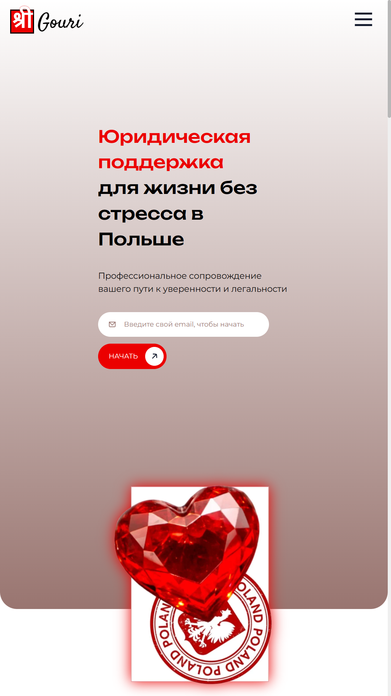
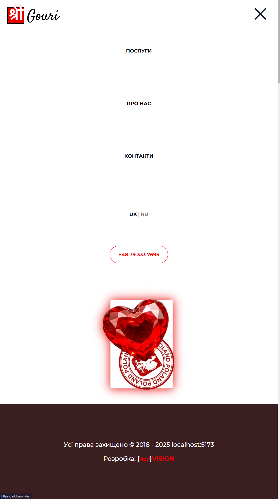
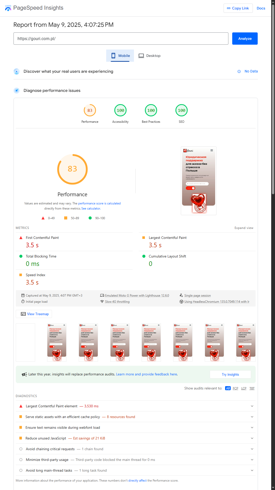

# 🌐 GOURI — Юридичний супровід у Польщі

**[➡ Відкрити сайт](http://gouri.com.pl/)**  
Професійна допомога українцям у Польщі: легалізація, юридичні консультації, переклади та супровід.

---

## 🖼️ Інтерфейс сайту

| Скриншот сайту (портрет) | Альтернативний |
|--------------------------|----------------|
|  |  |

---

## ⚙️ Технології

- **Vue 3** (Composition API)
- **Vite** — швидкий білд
- **Vue I18n** — локалізація
- **SASS** — стилі
- **EmailJS** — форма зворотного зв’язку
- **Critical CSS** — оптимізація First Contentful Paint
- **GitHub Pages** — деплой

---

## 📁 Структура проєкту

<details>
<summary>📂 <code>src/</code></summary>

```txt
App.vue              # Основний layout з усіма секціями
components/          # Всі секції сторінки (Hero, About, FAQ тощо)
directives/          # Кастомні директиви
i18n/                # Файли локалізації
assets/              # Зображення та ресурси
style.css            # Глобальні стилі
```
</details>

---

## 🎯 Оптимізація PageSpeed

Проєкт використовує `rollup-plugin-critical` для автоматичної вставки critical CSS при білді:

```js
critical({
  criticalUrl: 'https://gouri.com.pl/',
  criticalBase: 'dist/',
  criticalPages: [{ uri: '', template: 'index' }],
  criticalConfig: {
    inline: true,
    extract: false,
    width: 375,
    height: 812,
    penthouse: { blockJSRequests: false },
  },
})
```

Це знижує **Time to First Paint** і підвищує **PageSpeed Score**.

---

## 🚀 PageSpeed.web.dev

| Десктоп | Мобільна версія |
|--------|-----------------|
|  |  |

---

## 📬 Контакти

**Email:** gouri@wp.pl  
**Телефон:** +48 79 333 7695  
**Адреса:** Gdańska 117/3D, 85-022 Bydgoszcz, Poland  
**Соцмережі:** Facebook, Instagram, WhatsApp, Telegram

---

## 📄 Ліцензія

Приватний проєкт. Усі права захищено © 2018–2025

https://addvision.dev/

---
